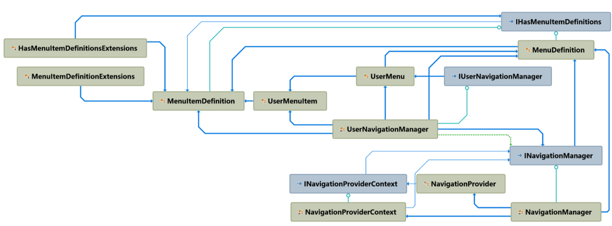
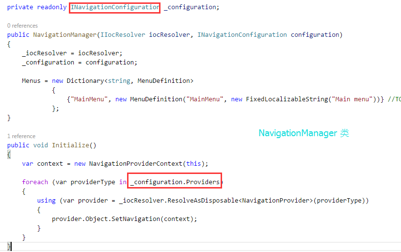
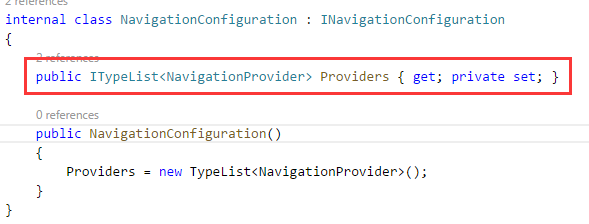
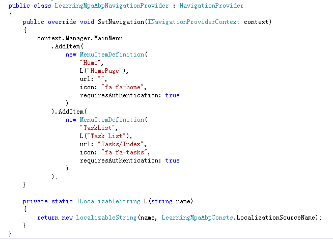
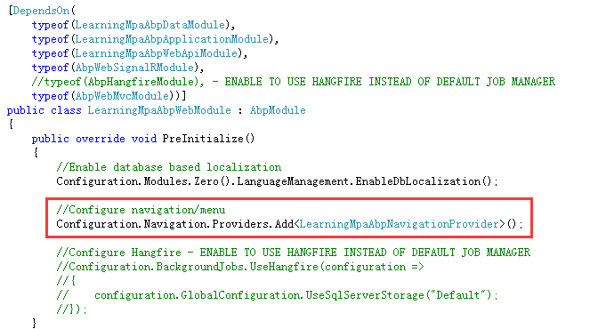
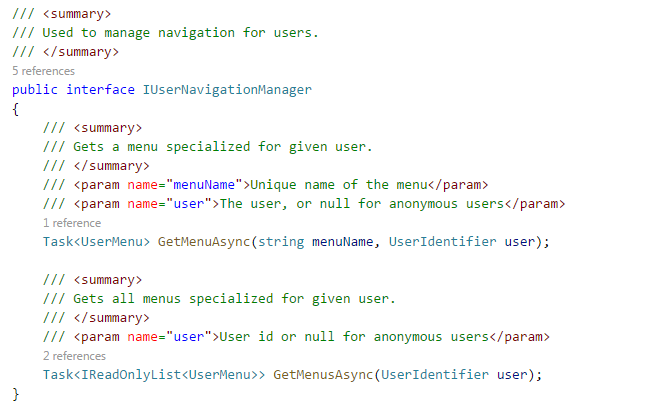

## 一、如何使用Abp集成的导航菜单

针对我们的『任务清单』Deom，我们需要在导航栏上添加一个【Task List】的菜单入口。

### 1、打开web展现层，定位到App_Start/xxxNavigationProvider.cs。
```
    public class LearningMpaAbpNavigationProvider : NavigationProvider
    {
        public override void SetNavigation(INavigationProviderContext context)
        {
            context.Manager.MainMenu
                .AddItem(
                    new MenuItemDefinition(
                        "Home",
                        L("HomePage"),
                        url: "",
                        icon: "fa fa-home",
                        requiresAuthentication: true
                        )
                ).AddItem(
                    new MenuItemDefinition(
                        "Tenants",
                        L("Tenants"),
                        url: "Tenants",
                        icon: "fa fa-globe",
                        requiredPermissionName: PermissionNames.Pages_Tenants
                        )
                ).AddItem(
                    new MenuItemDefinition(
                        "Users",
                        L("Users"),
                        url: "Users",
                        icon: "fa fa-users",
                        requiredPermissionName: PermissionNames.Pages_Users
                        )
                ).AddItem(
                    new MenuItemDefinition(
                        "About",
                        L("About"),
                        url: "About",
                        icon: "fa fa-info"
                        )
                );
    }
}
```
该文件中默认定义了Home、Tenants、Users、About四个菜单。注意观察的话，想必会注意到Home菜单设置了requiresAuthentication: true，即只有登陆后才会显示该菜单。Tenants和Users菜单设置了requiredPermissionName属性，即用户具有指定的权限时才显示菜单。About菜单没有限制，默认显示。
每一个菜单项都是一个MenuItemDefinition，其中主要包括Name（唯一名称），DisplayName（本地化显示名称），Url（菜单跳转），Icon（指定菜单图标）。
解释到这里，大家自己都可以依葫芦画瓢，新增菜单了。

### 2、添加[Task List]菜单项
```
AddItem(
  new MenuItemDefinition(
      "TaskList",
      L("Task List"),
      url: "Tasks/Index",
      icon: "fa fa-tasks",
      requiresAuthentication: true
  )
```
保存，刷新页面即可看到新增的[Task List]菜单了。


PS:之所以页面上会显示为[Task List]，是因为我们并没有维护本地化资源文件。在对应的本地化配置文件中新增名为"Task List"的即可。比如在中文的本地化文件中添加
<text name="Task List" value="任务清单" />，重新启站点，将语言切换为中文。
## 二、Abp集成的导航菜单的代码结构

### 1、先来看看相关代码的类型依赖关系图


类型依赖关系图

分析发现，abp集成的导航菜单实际上是应用了组合设计模式。
其中MenuDefinition为根节点，MenuItemDefinition为树枝节点，其中MenuItemDefinition中也维护了一个List<MenuItemDefinition>的集合，当集合为空时，MenuItemDefinition即为树叶节点。

### 2、从图中可以看出，主要是由以下几部分组成：

* MenuDefinition/MenuItemDefinition：菜单/菜单项定义。其中菜单项包括Name（唯一名称），DisplayName（本地化显示名称），Url（菜单跳转），Icon（指定菜单图标）。此外，可以通过指定RequiresAuthentication=true来限制菜单项只有对登录用户可见，同时也可以指定RequiredPermissionName来限定当用户有某个权限时菜单才可见。
* UserMenu/UserMenuItem：封装了用于显示给用户的菜单/子菜单集合。
* INavigationConfiguration/NavigationConfiguration：导航配置，维护了NavigationProvider的列表。
* NavigationProvider：Provider模式（将api的定义和实现分离）。抽象类，定义了SetNavigation方法，在需要设置导航的项目中实现该类，并在对应的模块中PreInitialize方法中注册***NavigationProvider的实现。
* INavigationManager/NavigationManager：其中接口中定义了一个Dictionary，用来存储应用程序中定义的所有菜单项，和一个MainMenu。注入了对INavigationConfiguration的引用，以便在NavigationManager中的Initialize方法遍历INavigationConfiguration配置的NavigationProvider列表进行菜单的初始化。
* IUserNavigationManager/UserNavigationManager：是对NavigationManager的一次封装。其中接口中定义了GetMenuAsync的重载方法，用来获取指定用户的菜单。
* INavigationProviderContext/NavigationProviderContext：封装了INavigationManager的上下文类，用于传参。
## 三、Abp集成的导航菜单的具体实现

核心逻辑：NavigationManager遍历NavigationConfiguration中维护的NavigationProvider列表，并调用NavigationProvider实现的SetNavigation方法来完成导航菜单的初始化。

***NavigationManager负责初始化菜单***


**NavigationConfiguration负责维护NavigationProvider的实现列表。**

具体的NavigationProvider的实现  

**在对应的模块中注册具体的NavigtionProvider到INavigationConfiguration维护的列表中。**


**UserNavigationManager对NavigationManager进行了进一步的封装，根据用户和权限去创建和获取菜单。**


**在LayoutController中，通过注入对IUserNavigationManager的引用，来获取菜单，并由_TopMenu分部页进行最终呈现。**
```
public class LayoutController : LearningMpaAbpControllerBase
    {
        private readonly IUserNavigationManager _userNavigationManager;
        private readonly ISessionAppService _sessionAppService;
        private readonly IMultiTenancyConfig _multiTenancyConfig;
        private readonly ILanguageManager _languageManager;

        public LayoutController(
            IUserNavigationManager userNavigationManager, 
            ISessionAppService sessionAppService, 
            IMultiTenancyConfig multiTenancyConfig,
            ILanguageManager languageManager)
        {
            _userNavigationManager = userNavigationManager;
            _sessionAppService = sessionAppService;
            _multiTenancyConfig = multiTenancyConfig;
            _languageManager = languageManager;
        }

        [ChildActionOnly]
        public PartialViewResult TopMenu(string activeMenu = "")
        {
            var model = new TopMenuViewModel
                        {
                            MainMenu = AsyncHelper.RunSync(() => _userNavigationManager.GetMenuAsync("MainMenu", AbpSession.ToUserIdentifier())),
                            ActiveMenuItemName = activeMenu
                        };

            return PartialView("_TopMenu", model);
        }
}
```
至此，我们完成了对导航菜单的梳理和总结。