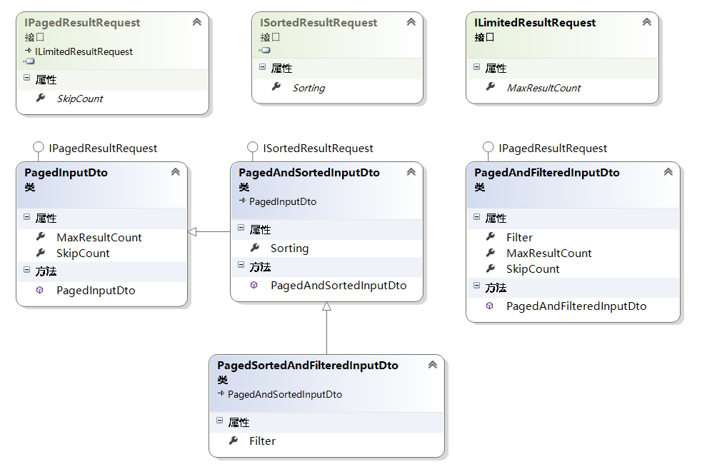
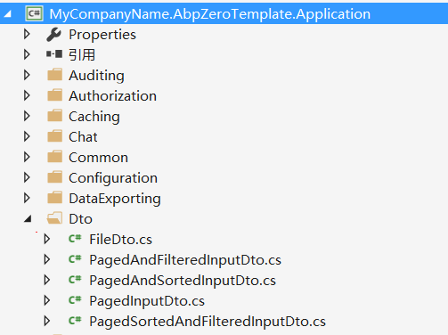
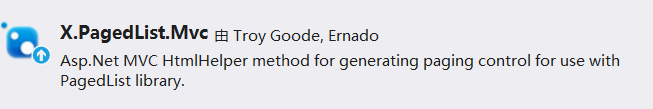

## 一、分页请求DTO定义

>数据传输对象(Data Transfer Objects)用于应用层和展现层的数据传输。
>展现层传入数据传输对象(DTO)调用一个应用服务方法，接着应用服务通过领域对象执行一些特定的业务逻辑并且返回DTO给展现层。这样展现层和领域层被完全分离开了。在具有良好分层的应用程序中，展现层不会直接使用领域对象(仓库，实体)。
我们在展现层有分页请求时，一般需要指定两个参数，一个用来标志第几页、一个是每页行数（一般有配置文件配置）。
因为分页是一个很常用的功能，所以，展现层我们有分页请求时，最好有相应的DTO来封装这两个参数。
在ABP源码中并没有为我们封装这样公用的类，但是在ABPZero项目中，定义了相应的分页Dto。
对应的类图如下：
  

分页排序过滤相应Dto类图
从中可以看到主要包括以下四个公共DTO定义：

1. PagedInputDto：分页请求Dto
2. PagedAndSortedInputDto：分页排序Dto
3. PagedSortedAndFilteredInputDto：分页排序过滤Dto
4. PagedAndFilteredInputDto：分页过滤Dto  
是不是很实用，我们的分页一般是和过滤排序混合使用的。

其中主要定义了以下几个主要属性：

* MaxResultCount：每页行数，可以从定义的配置中读取。
* SkipCount：跳转数量，一般计算公式为SkipCount=Page*MaxResultCount（页数*行数）。
* Filter：过滤字符串
* Sorting：排序方式
具体的实现就不详述了，相信仔细看类图，就能自己动手实现。AbpZero把这些公共Dto定义在了应用服务层的Dto文件夹下，具体路径如下图。
  

## 二、如何使用分页DTO

拿我们的任务清单举例，我们修改下创建的GetTaskInputDto，让它继承自PagedSortedAndFilteredInputDto，这样GetTaskInputDto就拥有了进行分页排序过滤需要用到的属性。
```
public class GetTasksInput : PagedSortedAndFilteredInputDto
{
    public TaskState? State { get; set; }

    public int? AssignedPersonId { get; set; }
}
```
## 三、返回分页结果DTO

Abp已经为我们定义了泛型的PagedResultDto用来包装返回的分页结果。其中主要包括两个属性，int TotalCount保存总个数，IReadOnlyList<T> Items保存返回的分页结果集。

## 四、应用服务层分页逻辑实现

1. 在ITaskAppService中定义接口
PagedResultDto<TaskDto> GetPagedTasks(GetTasksInput input);
2. 在TaskAppService中实现接口：
```
public PagedResultDto<TaskDto> GetPagedTasks(GetTasksInput input)
{
    //初步过滤
    var query = _taskRepository.GetAll().Include(t => t.AssignedPerson)
        .WhereIf(input.State.HasValue, t => t.State == input.State.Value)
        .WhereIf(!input.Filter.IsNullOrEmpty(), t => t.Title.Contains(input.Filter))
        .WhereIf(input.AssignedPersonId.HasValue, t => t.AssignedPersonId == input.AssignedPersonId.Value);

    //排序
    query = !string.IsNullOrEmpty(input.Sorting) ? query.OrderBy(input.Sorting) : query.OrderByDescending(t => t.CreationTime);

    //获取总数
    var tasksCount = query.Count();
    //默认的分页方式
    //var taskList = query.Skip(input.SkipCount).Take(input.MaxResultCount).ToList();

    //ABP提供了扩展方法PageBy分页方式
    var taskList = query.PageBy(input).ToList();

    return new PagedResultDto<TaskDto>(tasksCount,taskList.MapTo<List<TaskDto>>());
}
```
分页的实现很简单，先进行过滤，排序，再进行分页，最后使用PagedResultDto封装分页结果。
细心的你也许发现了两个未曾在Linq中用过的方法WhereIf和PageBy，是的，这是ABP提供的扩展方法，感兴趣的可以看下源码QueryableExtensions的具体实现，其实实现的很简单，但我们平时在使用linq时却未必能想得到。

在这里提几个问题：

1. 请问在这段代码中共进行了几次查询？
2. 代码中使用的是什么分页技术？（真分页？假分页？）
## 五、使用X.PagedList进行前端分页

在Asp.Net Mvc中进行前端分页有一系列开源实现，在我的Demo中使用的是开源的X.PagedList分页。想了解具体源码，请参考X.PagedList GitHub。

1. 请自行在Web项目中安装X.PagedList.Mvc Nuget程序包  


2. 在Controller中使用X.PagedList提供的方法构造分页结果供前端使用
因为我们在应用服务层已经手动实现了分页逻辑，所以按照X.PagedList官网示例，我们需要自行构造StaticPagedList作为返回结果。
```
 public ActionResult PagedList(int? page)
 {
     //每页行数
     var pageSize = 5;
     var pageNumber = page ?? 1;//第几页

     var filter = new GetTasksInput
     {
         SkipCount = (pageNumber - 1) * pageSize,//忽略个数
         MaxResultCount = pageSize
     };
     var result = _taskAppService.GetPagedTasks(filter);

     //已经在应用服务层手动完成了分页逻辑，所以需手动构造分页结果
     var onePageOfTasks = new StaticPagedList<TaskDto>(result.Items, pageNumber, pageSize, result.TotalCount);
     //将分页结果放入ViewBag供View使用
     ViewBag.OnePageOfTasks = onePageOfTasks;

     return View();
}
```
从代码中可以看到我们构造完X.PagedList提供的分页结果后放入了ViewBag中，供视图使用。

3. View中添加分页控件
PagedList视图的代码如下：
```
@using X.PagedList.Mvc;
@using Abp.Web.Mvc.Extensions
@using X.PagedList; 
<link href="~/Content/PagedList.css" rel="stylesheet" />
<ul class="list-group">
    @foreach (var task in ViewBag.OnePageOfTasks)
    {
        <li class="list-group-item">
            <div class="btn-group pull-right">
                <button type="button" class="btn btn-info">Edit</button>
                <button type="button" class="btn btn-success">Delete</button>
            </div>

            <div class="media">
                <a class="media-left" href="#">
                    @*<i class="fa @Model.GetTaskLable(task) fa-3x"></i>*@
                </a>
                <div class="media-body">
                    <h4 class="media-heading">@task.Title</h4>
                    <span class="text-muted">@task.CreationTime.ToString("yyyy-MM-dd HH:mm:ss")</span>
                </div>
            </div>

        </li>
    }
</ul>

@Html.PagedListPager((IPagedList)ViewBag.OnePageOfTasks, page => Url.Action("PagedList", new { page }))
```
其中最后一句代码是用来生成分页控件。


## 总结

本节主要讲解了如何使用ABP进行后台分页，并顺带讲解了ABP后台分页逻辑的实现方式。同时也演示了如何使用X.PagedList进行前端分页。