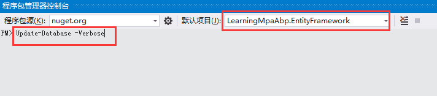
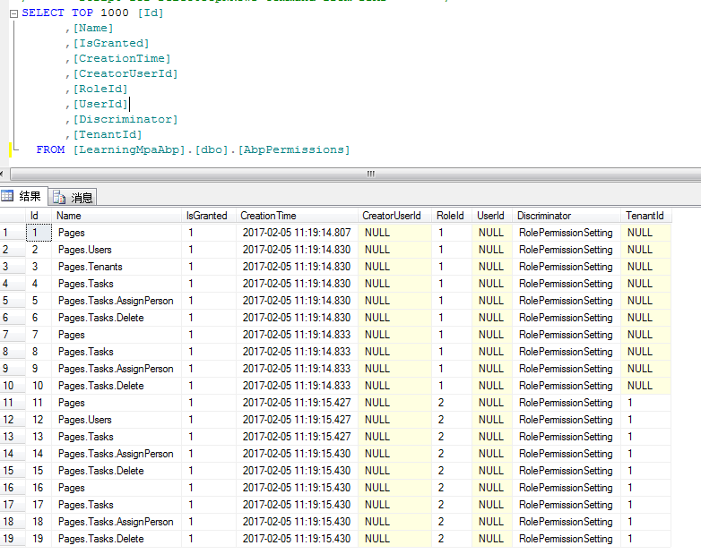

涉及到权限，那我们就细化下任务清单的功能点：

* 登录的用户才能查看任务清单
* 用户可以无限创建任务并分配给自己，但只能对自己创建的任务进行查找、修改
* 管理员可以创建任务并分配给他人
* 管理员具有删除任务的权限

从以上的信息中，我们可以提取出以下权限：

* 任务分配权限
*任务删除权限

那我们下面就来实现针对这两个权限的管理：

## 一、ABP权限管理的实现

### 1、先来看看权限定义相关类型


从该类型依赖图中我们可以看出：

* Permission：权限类，定义了权限的属性。
* PermissionDictionary：继承自Dictionary<string, Permission>类，存储permission对象的字典。
* IPermisssionDefinitionContext：定义了CreatePermission和GetPermissionOrNull方法，分别用来创建和获取权限。
* AuthorizationProvider：抽象类，在Module中实现该接口来定义权限。
* PermissionManager：权限管理类，继承自PermissionDefinitionContextBase主要提供了获取权限的系列方法。
### 2、再来看看权限检查相关类型


从该类型依赖图中简要梳理下核心类：

* IPermissionChecker：从接口命名就明白，这个是用来进行权限检查的。我们可以自己实现它，也可以使用module-zero中给出的实现。
* NullPermissionChecker：当未实现IPermissionChecker，系统会默认使用此类将权限赋予给每个用户。
* AbpAuthorizeAttribute：权限检查特性，在应用服务层标注需要的权限。
* AbpAllowAnonymousAttribute：匿名访问特性，忽略权限检查，用于应用服务层。在mvc和webapi中使用[AllowAnonymous]。
* AuthorizationInterceptor：授权拦截器，用来拦截定义了AbpAuthorizeAttribute特性的方法。
核心的几个类就讲到这里，具体的实现，可以自行查看[源码](https://github.com/aspnetboilerplate/aspnetboilerplate/tree/a706b7e8f497a4afe2bb746892fd6c010b0875fc/src/Abp/Authorization)一探究竟。

## 二、定义权限

从上节中我们知道在不同的Module中通过继承AuthorizationProvider来定义权限。ABP模板项目中已经在领域层，也就是.Core结尾的项目中，定义了xxxxxxAuthorizationProvider类继承自AuthorizationProvider。

### 1、权限包含哪些属性

* Name：系统中 唯一的名字。最好为权限的名字定义一个const字符串而不是变量字符串。我们偏向使用“.”符号用于有层次的名字，但这不是强制的。你可以设置任何你喜欢的名字，唯一的一点是保证它必须是唯一的。
* DisplayName：用于以后在UI上显示权限的本地化字符串。
* Description：用于以后在UI上显示权限定义的本地化字符串。
* IsGrantedByDefault：表示该权限是否授予给所有登录的用户，除非该权限显式禁止未授予给用户。该值一般默认为false。
* MultiTenancySides：对于多租户应用，租户或者租主可以使用同一个权限。这是一个Flags枚举，因此一个权限可以用于租户和租主。
featureDependency：可以用于声明一个功能的依赖。因此，只有功能依赖满足了，该权限才会被授予。
### 2、定义任务分配和任务删除权限

ABP模板项目默认已经在.Core/Authorization/目录下创建了AuthorizationProvider的派生类xxxxAuthorizationProvider.cs
其中代码为：
```
public override void SetPermissions(IPermissionDefinitionContext context)
{
    //Common permissions
    var pages = context.GetPermissionOrNull(PermissionNames.Pages);
    if (pages == null)
        pages = context.CreatePermission(PermissionNames.Pages, L("Pages"));

    var users = pages.CreateChildPermission(PermissionNames.Pages_Users, L("Users"));

    //Host permissions
    var tenants = pages.CreateChildPermission(PermissionNames.Pages_Tenants, L("Tenants"),
        multiTenancySides: MultiTenancySides.Host);
}
```
可以看出主要添加了三个权限，Pages、Users、Tenants。
依葫芦画瓢，咱们创建一个TaskAuthorizationProvider继承自AuthorizationProvider。
代码如下：
```
public class TaskAuthorizationProvider : AuthorizationProvider
{
    public override void SetPermissions(IPermissionDefinitionContext context)
    {
        //Common permissions
        var pages = context.GetPermissionOrNull(PermissionNames.Pages);
        if (pages == null)
            pages = context.CreatePermission(PermissionNames.Pages, L("Pages"));

        //Tasks
        var tasks = pages.CreateChildPermission(PermissionNames.Pages_Tasks, L("Tasks"));
        tasks.CreateChildPermission(PermissionNames.Pages_Tasks_AssignPerson, L("AssignTaskToPerson"));
        tasks.CreateChildPermission(PermissionNames.Pages_Tasks_Delete, L("DeleteTask"));
    }

    private static ILocalizableString L(string name)
    {
        return new LocalizableString(name, LearningMpaAbpConsts.LocalizationSourceName);
    }
}
```
并在常量PermissionNames类中维护唯一用户名。
```
public const string Pages_Tasks = "Pages.Pages.Tasks";

public const string Pages_Tasks_AssignPerson = "Pages.Pages.Tasks.AssignPerson";

public const string Pages_Tasks_Delete = "Pages.Pages.Tasks.Delete";
```
需要本地化显示的，则需要分别维护本地化xml文件，这里忽略此步。

### 3、注册TaskAuthorizationProvider

定位到.Core/xxxCoreModule.cs文件中发现Abp已经注册了默认实现的xxxxAuthorizationProvider.cs。
Configuration.Authorization.Providers.Add<LearningMpaAbpAuthorizationProvider>();
因为ABP是模块化的，当你需要为自己自定义的模块定义权限时，
不要忘记在自己定义的Module中注册自己实现的AuthorizationProvider（授权提供器）。
所以，还是依葫芦画瓢，注册TaskAuthorizationProvider：
Configuration.Authorization.Providers.Add<TaskAuthorizationProvider>();

## 三、权限检查

### 1、使用[AbpAuthorize]特性

在应用服务层中直接使用[AbpAuthorize]特性，但在MVC控制器中使用[AbpMvcAuthorize]特性，Web API控制器中使用[AbpApiAuthorize]。

我们在应用服务层给删除操作定义权限检查：
```
[AbpAuthorize(PermissionNames.Pages_Tasks_Delete)]
public void DeleteTask(int taskId)
{
    var task = _taskRepository.Get(taskId);
    if (task != null)
        _taskRepository.Delete(task);
}
```
F5运行，去删除某一任务，将获得以下提示：


### 2、使用IPermissionChecker

删除任务是一个独立的操作，所以我们可以直接使用上面特性声明的方式来进行权限检查。
但是针对【任务分配】这个操作，它其实是任务创建、编辑中的一个子操作。所以我们不能直接使用特性声明的方式来进行权限检查。这一次我们使用IPermissionChecker来进行检查。

#### 1、应用服务层注入了PermissionChecker属性

因为授权一般在应用服务层中进行，所以ABP默认在ApplicationService基类注入并定义了PermissionChecker属性。这样，在应用服务层就可以直接使用PermissionChecker属性进行权限检查。

#### 2、修改创建任务方法，加入权限检查
```
public int CreateTask(CreateTaskInput input)
{
    //We can use Logger, it's defined in ApplicationService class.
    Logger.Info("Creating a task for input: " + input);

    //获取当前用户
    var currentUser = AsyncHelper.RunSync(this.GetCurrentUserAsync);

    //判断用户是否有权限
    if (input.AssignedPersonId.HasValue && input.AssignedPersonId.Value != currentUser.Id)
        PermissionChecker.Authorize(PermissionNames.Pages_Tasks_AssignPerson);

    var task = Mapper.Map<Task>(input);

    int result = _taskRepository.InsertAndGetId(task);

    //只有创建成功才发送邮件和通知
    if (result > 0)
    {
        task.CreationTime = Clock.Now;

        if (input.AssignedPersonId.HasValue)
        {
            task.AssignedPerson = _userRepository.Load(input.AssignedPersonId.Value);
            var message = "You hava been assigned one task into your todo list.";

            //TODO:需要重新配置QQ邮箱密码
            //SmtpEmailSender emailSender = new SmtpEmailSender(_smtpEmialSenderConfig);
            //emailSender.Send("ysjshengjie@qq.com", task.AssignedPerson.EmailAddress, "New Todo item", message);

            _notificationPublisher.Publish("NewTask", new MessageNotificationData(message), null,
                NotificationSeverity.Info, new[] { task.AssignedPerson.ToUserIdentifier() });
        }
    }
```
其中权限检查代码为：PermissionChecker.Authorize(PermissionNames.Pages_Tasks_AssignPerson);这种方式当没有权限时，将直接抛出异常。当启用<customErrors mode="On" />时，将跳转至Error视图并显示以下信息。


#### 3、修改编辑任务方法，加入权限检查
```
public void UpdateTask(UpdateTaskInput input)
{
    //We can use Logger, it's defined in ApplicationService base class.
    Logger.Info("Updating a task for input: " + input);

    //获取当前用户
    var currentUser = AsyncHelper.RunSync(this.GetCurrentUserAsync);
    //获取是否有权限
    bool canAssignTaskToOther = PermissionChecker.IsGranted(PermissionNames.Pages_Tasks_AssignPerson);
    //如果任务已经分配且未分配给自己，且不具有分配任务权限，则抛出异常
    if (input.AssignedPersonId.HasValue && input.AssignedPersonId.Value != currentUser.Id && !canAssignTaskToOther)
    {
        throw new AbpAuthorizationException("没有分配任务给他人的权限！");
    }

    var updateTask = Mapper.Map<Task>(input);
    _taskRepository.Update(updateTask);
}
```
其中权限检查代码为PermissionChecker.IsGranted(PermissionNames.Pages_Tasks_AssignPerson);，IsGranted()方法返回true or false。


#### 4、Razor页面如何进行权限检查

视图基类定义了IsGranted方法来检查当前用户是否具有权限。我们可以在_List.cshtml.cs中加入以下代码来控制是否显示删除按钮。
```
@if (IsGranted(PermissionNames.Pages_Tasks_Delete))
{
    <button type="button" class="btn btn-success" onclick="deleteTask(@task.Id);">Delete</button>
}
```
#### 5、js代码如何进行权限检查

abp.auth命名空间下定义了权限相关的API，在js中我们可以直接使用。
这里不再举例。

## 四、将新增的权限赋予给Admin

完成了权限的定义和检查，我们如何进行权限设置呢，如何为角色或用户赋予权限呢？
在ABP模板项目中暂未提供用户角色权限管理功能，但在AbpZero中提供了该功能，支持按用户或角色赋予权限。那咋办呢？
咱们退而求其次，在数据库初始化的时候，将权限赋给Admin。
但是我们的数据库已经建立好了啊？
反正是测试库，删掉重建呗。

### 1、删除数据库

怎么删数据库，自己应该知道吧。

4.2. 代码中为Admin赋予权限

打开基础设施层，即以EntityFramework结尾的项目中，定位到Migrations\SeedData文件夹，分别在
HostRoleAndUserCreator和TenantRoleAndUserBuilder两个类中添加以下代码：
```
var taskPermissions = PermissionFinder.GetAllPermissions(new PersonAppAuthorizationProvider()).ToList();
permissions.AddRange(taskPermissions);
```

4.3. 重新编译整个项目，执行Update-Database


查看数据库，发现已经将Permission赋予给了admin


总结：

本节主要讲解了ABP权限管理的基本实现方式，以及如何定义、使用和添加权限。

在ABP模板项目中暂未提供用户角色权限管理功能，但在AbpZero中提供了该功能，支持按用户或角色赋予权限。这一节先暂时不表，等我研究通彻了再和大家娓娓道来。

遗留问题：

1. 在模态框上如何弹出异常信息?