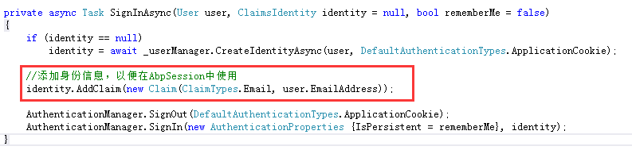

## 一、AbpSession是Session吗？

### 1、首先来看看它们分别对应的类型是什么？

查看源码发现Session是定义在Controller中的类型为HttpSessionStateBase的属性。
```
public HttpSessionStateBase Session { get; set; }
```

再来看看AbpSession是何须类也，咱们定位到AbpController中看一看。
```
public IAbpSession AbpSession { get; set; }
```

好吧，原来AbpSession是IAbpSession类型啊。但这就可以断定AbpSession不是Session吗？  
未必吧，如果IAbpsession的具体实现中还是依赖Session也不一定哦，如果是这样，那AbpSession可以算作Session的扩展，也可以说是Session。  
咱还是找找IAbpsession的具体实现一探究竟吧。  
Abp中对IAbpsession有两个实现方式，一种是NullAbpSession，NullAbpSession是空对象设计模式，用于属性注入时，在构造函数中对其初始化。  
另一种是ClaimsAbpSession，咱们来一探究竟。

### 2、一探究竟ClaimsAbpSession

以下代码是ClaimsAbpSession的节选：
```
/// <summary>
/// Implements <see cref="IAbpSession"/> to get session properties from claims of <see cref="Thread.CurrentPrincipal"/>.
/// </summary>
public class ClaimsAbpSession : IAbpSession, ISingletonDependency
{
    public virtual long? UserId
    {
        get
        {
            var userIdClaim = PrincipalAccessor.Principal?.Claims.FirstOrDefault(c => c.Type == ClaimTypes.NameIdentifier);
            if (string.IsNullOrEmpty(userIdClaim?.Value))
            {
                return null;
            }

            long userId;
            if (!long.TryParse(userIdClaim.Value, out userId))
            {
                return null;
            }

            return userId;
        }
    }

    public IPrincipalAccessor PrincipalAccessor { get; set; }

    public ClaimsAbpSession(IMultiTenancyConfig multiTenancy)
    {
        MultiTenancy = multiTenancy;
        PrincipalAccessor = DefaultPrincipalAccessor.Instance;
    }
}
```
其中IPrincipalAccessor又是什么鬼，从构造函数来看，DefaultPrincipalAccessor应该是个单例模式。
```
public class DefaultPrincipalAccessor : IPrincipalAccessor, ISingletonDependency
{
   public virtual ClaimsPrincipal Principal => Thread.CurrentPrincipal as ClaimsPrincipal;
   public static DefaultPrincipalAccessor Instance => new DefaultPrincipalAccessor();
}
```
其中public static DefaultPrincipalAccessor Instance => new DefaultPrincipalAccessor();是属性表达式写法，相当于：
```
public static DefaultPrincipalAccessor Instance 
{    
    get { new DefaultPrincipalAccessor();}
}
```
所以并非是单例模式（长了个记性，并不是定义了Instance属性的就是单例）

将上面两部分代码一中和，AbpSession中的UserId不就是这样获得的：
```
((ClaimsPrincipal)Thread.CurrentPrincipal).Claims.FirstOrDefault(c => c.Type == ClaimTypes.NameIdentifier);
```

好了一切一目了然了，AbpSession最终依赖的是ClaimsPrincipal，并不是Session。

所以AbpSession不是Session！！！
所以AbpSession不是Session！！！
所以AbpSession不是Session！！！

那ClaimsPrincipal又是什么鬼？我就喜欢你这打破砂锅问到底的劲，且听我娓娓道来。

## 二、Identity身份认证

本节主要参考自博客园[Savorboard](http://www.cnblogs.com/savorboard/)的博文，在此感谢Savorboard的精彩分享，建议大家去细细品读一番：

>[ASP.NET Core 之 Identity 入门（一）](http://www.cnblogs.com/savorboard/p/aspnetcore-identity.html)
>[ASP.NET Core 之 Identity 入门（二）](http://www.cnblogs.com/savorboard/p/aspnetcore-identity2.html)
>[ASP.NET Core 之 Identity 入门（三）](http://www.cnblogs.com/savorboard/p/aspnetcore-identity3.html)
### 1、Cliam（身份信息）

拿身份证举例，其中包括姓名：奥巴马、性别：男、民族：xx、出生：xx、住址：xx、公民省份号码：xxx，这些键值对都是身份信息。其中姓名、性别、民族、出生、住址、公民省份号码这些是身份信息类别（ClaimsType），微软已经给我们预定义了一系列的身份信息类别，其中包括（Email、Gender、Phone等等）。


### 2、ClaimsIdentity（身份证）

有了身份信息，一组装，不就成了身份证。
看下ClaimsIdentity的简要代码：
```
public class ClaimsIdentity: IIdentity
{
    public virtual IEnumerable<Claim> Claims
    {
    get {   //省略其他代码  }
    }

    //名字这么重要，当然不能让别人随便改啊，所以我不许 set，除了我儿子跟我姓，所以是 virtual 的
    public virtual string Name { get; }

    //这是我的证件类型，也很重要，同样不许 set
    public virtual string AuthenticationType { get; }

    public virtual void AddClaim(Claim claim);

    public virtual void RemoveClaim(Claim claim);

    public virtual void FindClaim(Claim claim);
}
```
可以看到ClaimsIdentity维护了一个Claim枚举列表。
其中AuthenticationType，从字面意思理解是验证类型。什么意思呢？比如我们拿身份证去政府部门办理业务时，有时需要持本人身份证，但有时候需要身份证复印件即可。

### 3、ClaimsPrincipal （证件所有者）

我们用身份信息构造了一个身份证，这个身份证肯定是属于具体的某个人吧。
所以ClaimsPrincipal就是用来维护一堆证件的。
因为现实生活中也是这样，我们有身份证、银行卡、社保卡等一系列证件。
那咱们就来看.net中是怎样实现的：
```
//核心代码部分
public class ClaimsPrincipal :IPrincipal
{
    //把拥有的证件都给当事人
    public ClaimsPrincipal(IEnumerable<ClaimsIdentity> identities){}

    //当事人的主身份呢
    public virtual IIdentity Identity { get; }

    public virtual IEnumerable<ClaimsIdentity> Identities { get; }

    public virtual void AddIdentity(ClaimsIdentity identity);

    //为什么没有RemoveIdentity ， 留给大家思考吧？
}
```
了解了这些概念，我们再来看看Identity的简要登陆流程：


从这张图来看，我们登陆的时候提供一些身份信息Claim（用户名/密码），然后Identity中间件根据这些身份信息构造出一张身份证ClaimsIdentity，然后把身份证交给ClaimsPrincipal证件所有者保管。

## 三、捋一捋Abp中的登陆流程

定位到AccountController，关注下以下代码：
```
[HttpPost]
[DisableAuditing]
public async Task<JsonResult> Login(LoginViewModel loginModel, string returnUrl = "", string returnUrlHash = "")
{
    CheckModelState();

    var loginResult = await GetLoginResultAsync(
        loginModel.UsernameOrEmailAddress,
        loginModel.Password,
        loginModel.TenancyName
        );

    await SignInAsync(loginResult.User, loginResult.Identity, loginModel.RememberMe);

    if (string.IsNullOrWhiteSpace(returnUrl))
    {
        returnUrl = Request.ApplicationPath;
    }

    if (!string.IsNullOrWhiteSpace(returnUrlHash))
    {
        returnUrl = returnUrl + returnUrlHash;
    }

    return Json(new AjaxResponse { TargetUrl = returnUrl });
}

private async Task<AbpLoginResult<Tenant, User>> GetLoginResultAsync(string usernameOrEmailAddress, string password, string tenancyName)
{
    var loginResult = await _logInManager.LoginAsync(usernameOrEmailAddress, password, tenancyName);

    switch (loginResult.Result)
    {
        case AbpLoginResultType.Success:
            return loginResult;
        default:
            throw CreateExceptionForFailedLoginAttempt(loginResult.Result, usernameOrEmailAddress, tenancyName);
    }
}

private async Task SignInAsync(User user, ClaimsIdentity identity = null, bool rememberMe = false)
{
    if (identity == null)
    {
        identity = await _userManager.CreateIdentityAsync(user, DefaultAuthenticationTypes.ApplicationCookie);
    }

    AuthenticationManager.SignOut(DefaultAuthenticationTypes.ApplicationCookie);
    AuthenticationManager.SignIn(new AuthenticationProperties { IsPersistent = rememberMe }, identity);
}
```
分析发现主要包括以下几个步骤：
1. GetLoginResultAsync --> loginManager.LoginAsync --> userManager.CreateIdentityAsync：不要以为调用了LoginAsync就以为是登录，其实这是伪登录。主要根据用户名密码去核对用户信息，构造User对象返回，然后再根据User对象的身份信息去构造身份证（CliamsIdentity）。
2.SignInAsync --> AuthenticationManager.SignOut
-->AuthenticationManager.SignIn ：
AuthenticationManager（认证管理员），负责真正的登入登出。SignIn的时候将第一步构造的身份证（CliamsIdentity）交给证件所有者（ClaimsPrincipal）。

是不是明白该怎么扩展AbpSession了？
**关键是往身份证（CliamsIdentity）中添加身份信息（Cliam）啊！！！**


其实去github上Abp官网搜issue，发现土耳其大牛也是给的这种扩展思路，详参[此链](https://gist.github.com/hikalkan/67469e05475c2d18cb88)。

## 四、开始扩展AbpSession（第一种方式：推荐）

上一节已经理清了思路，这一节咱们就撸起袖子扩展吧。
现在假设我们需要扩展一个Email属性：

### 1、登录前添加Cliam（身份信息）

定位到AccountController，修改SignInAsync方法，在调用AuthenticationManager.SignIn之前添加下面代码：
identity.AddClaim(new Claim(ClaimTypes.Email, user.EmailAddress));


### 2、定义IAbpSession扩展类获取扩展属性

既然只要我们在登录的时候通过在身份信息中添加要扩展的属性，我们就可以通过ClaimsPrincipal中获取扩展的属性。
所以我们可以通过对IAbpSession进行扩展，通过扩展方法从CliamsPrincipal中获取扩展属性。

所以我们需要在领域层，也就是.Core结尾的项目中对IAbpSession进行扩展。定位到.Core结尾的项目中，添加Extensions文件夹，添加扩展类AbpSessionExtension2：
```
namespace LearningMpaAbp.Extensions
{
    /// <summary>
    /// 通过扩展方法来对AbpSession进行扩展
    /// </summary>
    public static class AbpSessionExtension2
    {
        public static string GetUserEmail(this IAbpSession session)
        {
            return GetClaimValue(ClaimTypes.Email);
        }

        private static string GetClaimValue( string claimType)
        {
            var claimsPrincipal = DefaultPrincipalAccessor.Instance.Principal;

            var claim = claimsPrincipal?.Claims.FirstOrDefault(c => c.Type == claimType);
            if (string.IsNullOrEmpty(claim?.Value))
                return null;

            return claim.Value;
        }
    }
}
```
通过扩展类，我们不需要做其他额外的更改，即可通过ApplicationService, AbpController 和 AbpApiController 这3个基类已经注入的AbpSession属性调用GetUserEmail()来获取扩展的Email属性。

这种方式时最简单的方式，推荐此种方法！！！

## 五、开始扩展AbpSession（第二种方式）

ApplicationService, AbpController 和 AbpApiController 这3个基类已经注入了AbpSession属性。
所以我们需要在领域层，也就是.Core结尾的项目中对AbpSession进行扩展。
现在假设我们需要扩展一个Email属性。

### 1、扩展IAbpSession

定位到.Core结尾的项目中，添加Extensions文件夹，然后添加IAbpSessionExtension接口继承自IAbpSession：
```
namespace LearningMpaAbp.Extensions
{
    public interface IAbpSessionExtension : IAbpSession
    {
        string Email { get; }
    }
}
```
### 2、实现IAbpSessionExtension

添加AbpSessionExtension类，继承自ClaimsAbpSession并实现IAbpSessionExtension接口。
```
namespace LearningMpaAbp.Extensions
{
    public class AbpSessionExtension : ClaimsAbpSession, IAbpSessionExtension
    {
        public AbpSessionExtension(IMultiTenancyConfig multiTenancy) : base(multiTenancy)
        {
        }

        public string Email => GetClaimValue(ClaimTypes.Email);

        private string GetClaimValue(string claimType)
        {
            var claimsPrincipal = PrincipalAccessor.Principal;

            var claim = claimsPrincipal?.Claims.FirstOrDefault(c => c.Type == claimType);
            if (string.IsNullOrEmpty(claim?.Value))
                return null;

            return claim.Value;
        }
    }
}
```
### 3、替换掉注入的AbpSession属性

先来替换掉AbpController中注入的AbpSession
定位到.Web\Controllers\xxxxControllerBase.cs，使用属性注入IAbpSessionExtension。添加以下代码：
```
//隐藏父类的AbpSession
public new IAbpSessionExtension AbpSession { get; set; }
```
再来替换掉ApplicationService中注入的AbpSession
定位到.Application\xxxxAppServiceBase.cs。使用属性注入IAbpSessionExtension，同样添加以下代码：
```
//隐藏父类的AbpSession
public new IAbpSessionExtension AbpSession { get; set; }
```
至于AbpApiController要不要替换AbpSession，就视情况而定了，如果你使用的是Abp提供的动态WebApi技术，就不需要替换了，因为毕竟最终调用的是应用服务层的Api。如果WebApi是自己代码实现的，那就仿照上面自行替换吧，就不罗嗦了。

很显然，这种方式教第一种方式要麻烦许多。。。

### 4、无图无真相


总结：

本文首先对AbpSession一探真面目，了解到AbpSession不是Session；
然后对Identity身份认证流程就行简要剖析，发现AbpSession是依赖于ClaimsPrincipal，从而确定扩展AbpSession的思路：关键是往身份证（CliamsIdentity）中添加身份信息（Cliam）啊！！！；
最终提供了两种扩展思路：
其中推荐通过对IAbpSession进行扩展，通过扩展方法从CliamsPrincipal中获取扩展属性。
本文参考了以下博文，在此再次感谢它们的精彩分享：

[ASP.NET Core 之 Identity 入门（一）--Savorboard](http://www.cnblogs.com/savorboard/p/aspnetcore-identity.html)
[ASP.NET Core 之 Identity 入门（二）--Savorboard](http://www.cnblogs.com/savorboard/p/aspnetcore-identity2.html)
[ASP.NET Core 之 Identity 入门（三）--Savorboard](http://www.cnblogs.com/savorboard/p/aspnetcore-identity3.html)
[Asp.net Boilerplate之AbpSession扩展--kid1412](http://www.cnblogs.com/kid1412/p/6259416.html)
[基于DDD的.NET开发框架 - ABP Session实现--Joye.Net](http://www.cnblogs.com/yinrq/p/5519917.html)