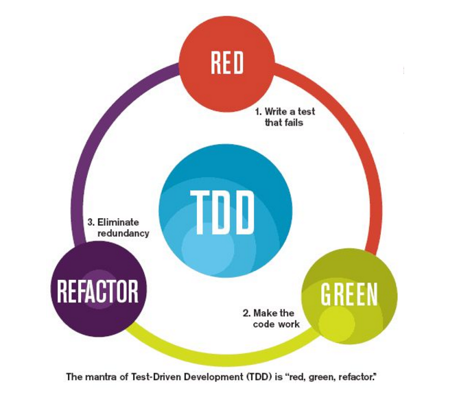
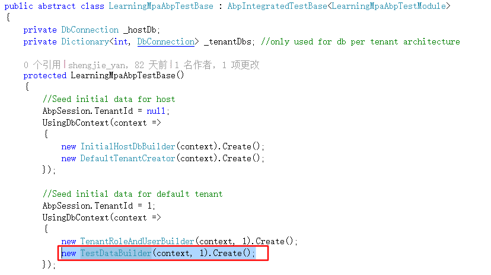
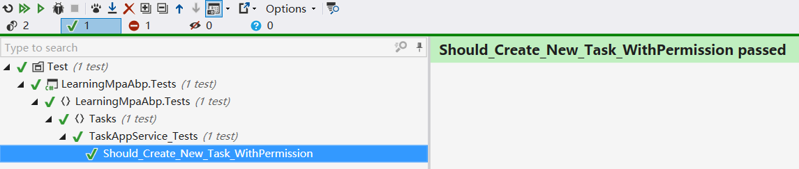
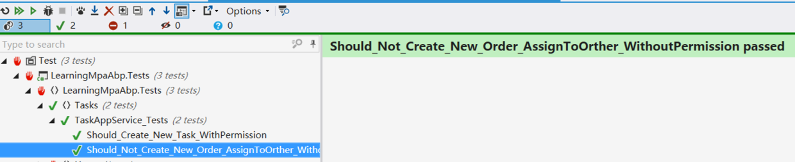
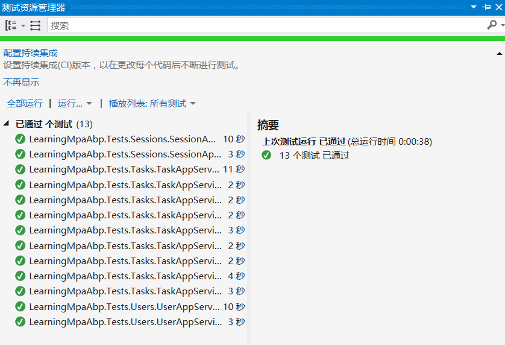

## 一、前言

>In computer programming, unit testing is a software testing method by which individual units of source code, sets of one or more computer program modules together with associated control data, usage procedures, and operating procedures, are tested to determine whether they are fit for use.
在电脑编程中，单元测试是一种软件测试方法。通过该方法来测试代码的单个单元、一个或多个计算机程序模块的集合以及相关联的控制数据、使用过程和操作过程，以确定它们是否适合使用。
单元测试是保证软件质量的重要指标。单元测试能够帮助我们提高程序的稳定性，使用单元测试更容易发现问题，也便于重构。TDD（测试驱动开发）的原理就是在开发功能代码之前先编写单元测试。但写单元测试也是一个浩大的工程。其中优劣也只有真正实践才能有更深的体会。



Abp作为一个优秀的框架，自然也应用了单元测试。Abp的代码都通过XUnit进行了单元测试。下面我们就延续Abp的优良作风，为我们的业务代码编写单元测试。

## 二、对Abp模板测试项目一探究竟


### 1、测试项目结构

如图所示，通过在Abp官网创建的模板项目中，默认就已经为我们创建好了测试项目。并对Session、User创建了单元测试。其中LearningMpaAbpTestBase是继承的集成测试基类，主要用来伪造一个数据库连接。该项目添加了对Application、Core、EntityFramework项目的引用，以便于我们针对它们进行测试，从这我们也可以看出，Abp是按照Service-->Repository-->Domain这条线来进行集成测试。
打开测试项目的NuGet程序包我们可以发现主要依赖了以下几个NuGet包：

* Abp.TestBase：提供了测试基类和基础架构以便我们创建单元集成测试。
* Effort.EF6：对基于EF的应用程序提供了一种便利的方式来进行单元测试。
* XUnit：.Net上好用的测试框架。
* Shouldly：断言框架，方便我们书写断言。
### 2\Effort（EF单元测试工具）

>It is basically an ADO.NET provider that executes all the data operations on a lightweight in-process main memory database instead of a traditional external database. It provides some intuitive helper methods too that make really easy to use this provider with existing ObjectContext or DbContext classes. A simple addition to existing code might be enough to create data driven tests that can run without the presence of the external database.
简而言之，Effort提供了一个轻量级的内存数据库，来执行所有数据操作。
想对Effort有更对了解，请直接访问[Effort Github官方链接](https://github.com/tamasflamich/effort)。

### 3、xUnit（.Net测试框架）

xUnit专门为.Net Framework打造的一个免费的开源的单元测试工具。
同样，想对Xunit有更对了解，请直接访问[xUnit 官方链接](http://xunit.github.io/)。

这里我们就简要介绍下xUnit的基本用法。
xUnit.net 支持两种主要类型的单元测试：facts and theories（事实和理论）。

>Facts are tests which are always true. They test invariant conditions.  
>Theories are tests which are only true for a particular set of data.  

>Facts：使用[Fact]标记的测试方法，表示不需要传参的常态测试方法。  
>Theories：使用[Theory]标记的测试方法，表示期望一个或多个DataAttribute实例用来提供参数化测试的方法的参数的值。
首先来看下[Fact]的简单示例：
```
    public class Class1
    {
        [Fact]
        public void PassingTest()
        {
            Assert.Equal(4, Add(2, 2));
        }

        [Fact]
        public void FailingTest()
        {
            Assert.Equal(5, Add(2, 2));
        }

        int Add(int x, int y)
        {
            return x + y;
        }
    }
```
其中xUnit.Net提供了三种继承于DataAttribute的特性（[InlineData]、 [ClassData]、 [PropertyData]）用于为[Theory]标记的参数化测试方法传参。
下面是使用这三种特性传参的实例：
**InlineData Example**
```
public class StringTests1
{
    [Theory,
    InlineData("goodnight moon", "moon", true),
    InlineData("hello world", "hi", false)]
    public void Contains(string input, string sub, bool expected)
    {
        var actual = input.Contains(sub);
        Assert.Equal(expected, actual);
    }
}
```
**PropertyData Example**
```
public class StringTests2
{
    [Theory, PropertyData("SplitCountData")]
    public void SplitCount(string input, int expectedCount)
    {
        var actualCount = input.Split(' ').Count();
        Assert.Equal(expectedCount, actualCount);
    }

    public static IEnumerable<object[]> SplitCountData
    {
        get
        {
            // Or this could read from a file. :)
            return new[]
            {
                new object[] { "xUnit", 1 },
                new object[] { "is fun", 2 },
                new object[] { "to test with", 3 }
            };
        }
    }
}
```
**ClassData Example**
```
public class StringTests3
{
    [Theory, ClassData(typeof(IndexOfData))]
    public void IndexOf(string input, char letter, int expected)
    {
        var actual = input.IndexOf(letter);
        Assert.Equal(expected, actual);
    }
}

public class IndexOfData : IEnumerable<object[]>
{
    private readonly List<object[]> _data = new List<object[]>
    {
        new object[] { "hello world", 'w', 6 },
        new object[] { "goodnight moon", 'w', -1 }
    };

    public IEnumerator<object[]> GetEnumerator()
    { return _data.GetEnumerator(); }

    IEnumerator IEnumerable.GetEnumerator()
    { return GetEnumerator(); }
}
```
### 4、Shouldly（断言框架）

Shouldly提供的断言方式与传统的Assert相比更实用易懂。
对比一下就明白了：
```
Assert.That(contestant.Points, Is.EqualTo(1337));
//Expected 1337 but was 0
contestant.Points.ShouldBe(1337);
//contestant.Points should be 1337 but was 0
```
首先上写法上更清晰易懂，第二当测试失败时，提示消息也更清楚直接。

同样，想对Shouldly有更对了解，请直接访问[Shouldly官方链接](https://github.com/shouldly/shouldly)。

### 5、测试基类XxxTestBase

首先来看看代码：
```
public abstract class LearningMpaAbpTestBase : AbpIntegratedTestBase<LearningMpaAbpTestModule>
    {
        private DbConnection _hostDb;
        private Dictionary<int, DbConnection> _tenantDbs; //only used for db per tenant architecture

        protected LearningMpaAbpTestBase()
        {
            //Seed initial data for host
            AbpSession.TenantId = null;
            UsingDbContext(context =>
            {
                new InitialHostDbBuilder(context).Create();
                new DefaultTenantCreator(context).Create();
            });

            //Seed initial data for default tenant
            AbpSession.TenantId = 1;
            UsingDbContext(context =>
            {
                new TenantRoleAndUserBuilder(context, 1).Create();
            });

            LoginAsDefaultTenantAdmin();
            UsingDbContext(context => new InitialDataBuilder().Build(context));
        }
        protected override void PreInitialize()
        {
            base.PreInitialize();

            /* You can switch database architecture here: */
            UseSingleDatabase();
            //UseDatabasePerTenant();
        }

        /* Uses single database for host and all tenants.
         */
        private void UseSingleDatabase()
        {
            _hostDb = DbConnectionFactory.CreateTransient();

            LocalIocManager.IocContainer.Register(
                Component.For<DbConnection>()
                    .UsingFactoryMethod(() => _hostDb)
                    .LifestyleSingleton()
                );
        }
//...省略后续代码
}
```
从该段代码中我们可以看出该测试基类继承自AbpIntegratedTestBase<T>。
在PreInitialize()方法中指定了为租户创建单一数据库还是多个数据库。
_hostDb = DbConnectionFactory.CreateTransient();是Effort提供的方法用来创建的DbConnection（数据库连接）。然后将其使用单例的模式注册到IOC容器中，这样在测试中，所有的数据库连接都将使用Effort为我们创建的数据库连接。
在构造函数中主要做了两件事，预置了初始数据和种子数据，并以默认租户Admin登录。

至此我们对abp为我们默认创建的测试项目有了一个大概的认识。下面我们就开始实战阶段。

## 三、单元测试实战

### 1、理清要测试的方法逻辑

我们以应用服务层的TaskAppService的CreateTask方法为例，创建单元测试。先来看看该方法的代码：
```
public int CreateTask(CreateTaskInput input) {
    //We can use Logger, it's defined in ApplicationService class.
    Logger.Info("Creating a task for input: " + input);

    //判断用户是否有权限
    if (input.AssignedPersonId.HasValue && input.AssignedPersonId.Value != AbpSession.GetUserId()) PermissionChecker.Authorize(PermissionNames.Pages_Tasks_AssignPerson);

    var task = Mapper.Map < Task > (input);

    int result = _taskRepository.InsertAndGetId(task);

    //只有创建成功才发送邮件和通知
    if (result > 0) {
        task.CreationTime = Clock.Now;

        if (input.AssignedPersonId.HasValue) {
            task.AssignedPerson = _userRepository.Load(input.AssignedPersonId.Value);
            var message = "You hava been assigned one task into your todo list.";

            //TODO:需要重新配置QQ邮箱密码
            //SmtpEmailSender emailSender = new SmtpEmailSender(_smtpEmialSenderConfig);
            //emailSender.Send("ysjshengjie@qq.com", task.AssignedPerson.EmailAddress, "New Todo item", message);
            _notificationPublisher.Publish("NewTask", new MessageNotificationData(message), null, NotificationSeverity.Info, new[] {
                task.AssignedPerson.ToUserIdentifier()
            });
        }
    }
```
该方法主要有三步，第一步判断权限，第二步保存数据库并返回Id，第三步发送通知。

### 2、创建单元测试类并注入依赖

创建TaskAppSerice_Tests类并继承自XxxTestBase类，并注入需要的依赖。
```
public class TaskAppService_Tests : LearningMpaAbpTestBase
    {
        private readonly ITaskAppService _taskAppService;

        public TaskAppService_Tests()
        {
            _taskAppService = Resolve<TaskAppService>();
        }
}
```
### 3、创建单元测试方法

第一个方法我们应该测试Happy path（即测试方法的默认场景，没有异常和错误信息）。
```
[Fact] 
public void Should_Create_New_Task_WithPermission() {
    //Arrange
    //LoginAsDefaultTenantAdmin();//基类的构造函数中已经以默认租户Admin登录。
    var initalCount = UsingDbContext(ctx = >ctx.Tasks.Count());
    var task1 = new CreateTaskInput() {
        Title = "Test Task",
        Description = "Test Task",
        State = TaskState.Open
    };

    var task2 = new CreateTaskInput() {
        Title = "Test Task2",
        Description = "Test Task2",
        State = TaskState.Open
    };

    //Act
    int taskResult1 = _taskAppService.CreateTask(task1);
    int taskResult2 = _taskAppService.CreateTask(task2);

    //Assert
    UsingDbContext(ctx = >{
        taskResult1.ShouldBeGreaterThan(0);
        taskResult2.ShouldBeGreaterThan(0);
        ctx.Tasks.Count().ShouldBe(initalCount + 2);
        ctx.Tasks.FirstOrDefault(t = >t.Title == "Test Task").ShouldNotBe(null);
        var task = ctx.Tasks.FirstOrDefault(t = >t.Title == "Test Task2");
        task.ShouldNotBe(null);
        task.State.ShouldBe(TaskState.Open);
    });
}
```
在这里��嗦一下单元测试的AAA原则：

* Arrange：为测试做准备工作
* Act：运行实际测试的代码
* Assert：断言，校验结果
再说明一下单元测试的方法推荐命名规则：
**some_result_occurs_when_doing...**

回到我们这个测试方法。
Arrange阶段我们先以Admin登录（Admin具有所有权限），然后获取数据库中初始Task的数量，再准备了两条测试数据。
Act阶段，直接调用TaskAppService的CreateTask方法。
Assert阶段：首先判断CreateTask的返回值大于0 ；再判断现在数据库的数量是否增加了2条；再校验数据库中是否包含创建的Task，并核对Task的状态。

### 4、预置数据

在进行测试的时候，我们肯定需要一些测试数据，以便我们进行合理的测试。
在基础设施层，我们有专门的SeedData目录用来预置种子数据。但是进行单元测试的测试数据不应该污染实体数据库，所以直接在SeedData目录预置数据就不太现实。

#### 1、创建TestDataBuilder

所以，我们就直接在测试项目中，新建一个TestDatas文件夹来管理测试种子数据。
然后创建TestDataBuilder类，通过该类来统一创建所需的测试数据。（注意，需要修改下类中的_context类型为你自己项目对应的DbContext）
```
namespace LearningMpaAbp.Tests.TestDatas
{
    public class TestDataBuilder
    {
        private readonly LearningMpaAbpDbContext _context;
        private readonly int _tenantId;

        public TestDataBuilder(LearningMpaAbpDbContext context, int tenantId)
        {
            _context = context;
            _tenantId = tenantId;
        }

        public void Create()
        {
            _context.DisableAllFilters();

            //new TestUserBuilder(_context,_tenantId).Create();
            //new TestTasksBuilder(_context,_tenantId).Create();

            _context.SaveChanges();
        }
    }
}
```
然后修改我们的测试基类XxxTestBase，在构造函数调用我们新建的TestDataBuilder的Create()方法。new TestDataBuilder(context, 1).Create();，如下图：


#### 2、创建Task测试数据

创建TestTasksBuilder，如下：（注意，需要修改下类中的_context类型为你自己项目对应的DbContext）
```
namespace LearningMpaAbp.Tests.TestDatas
{
    public class TestTasksBuilder
    {
        private readonly LearningMpaAbpDbContext _context;
        private readonly int _tenantId;

        public TestTasksBuilder(LearningMpaAbpDbContext context, int tenantId)
        {
            _context = context;
            _tenantId = tenantId;
        }

        public void Create()
        {
            for (int i = 0; i < 8; i++)
            {
                var task = new Task()
                {
                    Title = "TestTask" + i,
                    Description = "Test Task " + i,
                    CreationTime = DateTime.Now,
                    State = (TaskState)new Random().Next(0, 1)
                };
                _context.Tasks.Add(task);
            }

        }
    }
}
```
然后再在TestDataBuild中调用该类的Create()的方法即可。
```
new TestTasksBuilder(_context,_tenantId).Create();
```

#### 5、Run the test（单元测试跑起来）



喜闻乐见的绿色，单元测试通过。

### 6、完善测试用例

单元测试中我们仅仅测试Happy Path是远远不够的。因为毕竟我们只是测试了正常的正确场景。为了提高单元测试的覆盖度，我们应该针对代码可能出现的异常问题进行测试。
还拿我们刚刚的CreateTask方法为例，其中第二步有一个验证权限操作，当用户没有权限的时候，Task应该不能创建并抛出异常。那我们就针对无权限的场景补充一个单元测试吧。

#### 1、预置数据

无权限简单，直接创建一个新用户登录就ok了。但为了用户复用，我们还是在种子数据中预置测试用户吧。

回到我们的TestDatas目录，创建TestUserBuilder，来预置测试用户。
```
namespace LearningMpaAbp.Tests.TestDatas
{
    /// <summary>
    /// 预置测试用户（无权限）
    /// </summary>
    public class TestUserBuilder
    {
        private readonly LearningMpaAbpDbContext _context;
        private readonly int _tenantId;

        public TestUserBuilder(LearningMpaAbpDbContext context, int tenantId)
        {
            _context = context;
            _tenantId = tenantId;
        }

        public void Create()
        {
            var testUser =
                _context.Users.FirstOrDefault(u => u.TenantId == _tenantId && u.UserName == "TestUser");
            if (testUser == null)
            {
                testUser = new User
                {
                    TenantId = _tenantId,
                    UserName = "TestUser",
                    Name = "Test User",
                    Surname = "Test",
                    EmailAddress = "test@defaulttenant.com",
                    Password = User.DefaultPassword,
                    IsEmailConfirmed = true,
                    IsActive = true
                };

                _context.Users.Add(testUser);
            }

        }
    }
}
```
然后再在TestDataBuild中调用该类的Create()的方法即可。

new TestUserBuilder(_context,_tenantId).Create();


#### 2、完善单元测试

/// <summary>
/// 若没有分配任务给他人的权限，创建的任务指定给他人，则任务创建不成功。
/// </summary>
[Fact]
public void Should_Not_Create_New_Order_AssignToOrther_WithoutPermission()
{
    //Arrange
    LoginAsTenant(Tenant.DefaultTenantName, "TestUser");

    //获取admin用户
    var adminUser = UsingDbContext(ctx => ctx.Users.FirstOrDefault(u => u.UserName == User.AdminUserName));

    var newTask = new CreateTaskInput()
    {
        Title = "Test Task",
        Description = "Test Task",
        State = TaskState.Open,
        AssignedPersonId = adminUser.Id //TestUser创建Task并分配给Admin
    };

    //Act,Assert
    Assert.Throws<AbpAuthorizationException>(() => _taskAppService.CreateTask(newTask));

}
```
当用户无权限时，将抛出Abp封装的AbpAuthorizationException（未授权异常）。


单元测试用例，就讲这两个，剩下的自己动手完善吧。源码中已经覆盖测试，可供参考。


4. 总结

这篇文章中主要梳理了Abp中如何进行单元测试，以及依赖的xUnit、Effort、Shouldly框架的用法。并基于以上内容的总结，进行了单元测试的实战演练。