1. 升级Abp

本系列教程是基于Abp V1.0版本，现在Abp版本已经升级至V1.4.2，其中新增了New Feature，并对Abp做了相应的Enhancements，以及Bug fixs。现在我们就把它升级至最新版本，那如何升级呢？
下面就请按我的步骤来将Abp由V1.0升级至V1.4.2。

1.1. 过滤Abp Nuget包

VS打开解决方案文件，右键解决方案（不是某个项目），选中【管理解决方案的Nuget程序包（Ｎ）...】，如下图1.1。


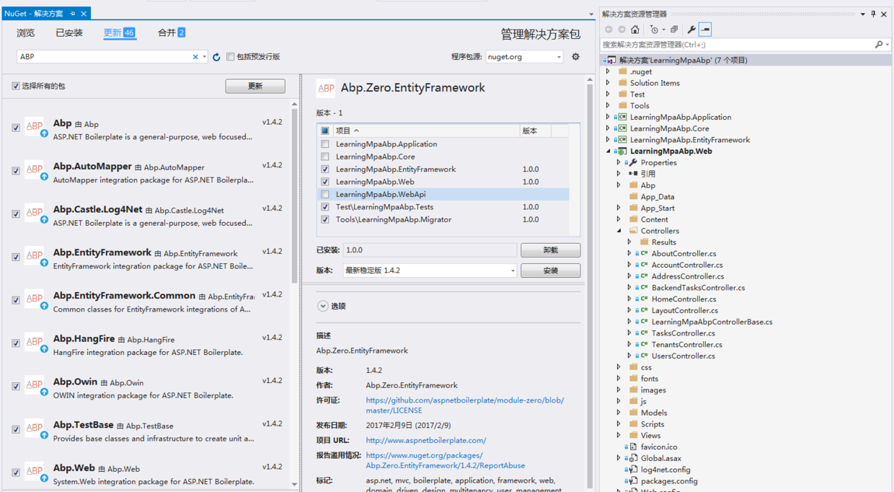
从图中可以看到，VS智能提示有42个Nuget包可升级，其中有2个Nuget程序包可合并。看到这个，不要犯了强迫症，就全部更新合并。
要知道，Nuget程序包是相互依赖的，不一定最新的就能相互兼容。
所以这一次，我们保险起见，只升级Abp相关Nuget程序包。
选中【更新】，在搜索框中录入Abp进行筛选Abp相关Nuget程序包（一共16个）。

1.2. 更新Abp相关Nuget包

勾选【选择所有的包】，并点击【更新】。VS会去分析解决方案下每个工程的Nuge包的依赖项，如下图1.2。


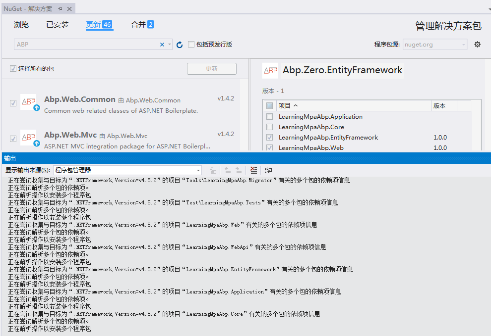

分析完毕后，弹出分析结果，即每个工程将要更新哪些Nuget包，如图1.3。


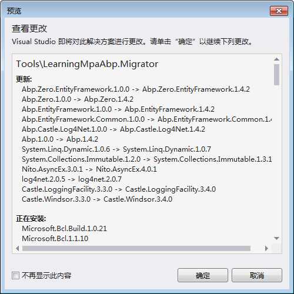
从图中可以发现，不仅仅是更新了Nuget包，依赖的相关包也将自动更新。
毫无疑问，点击【确定】，紧接着会弹出一个【接受许可证】，如图1.4，点击【我接受】。


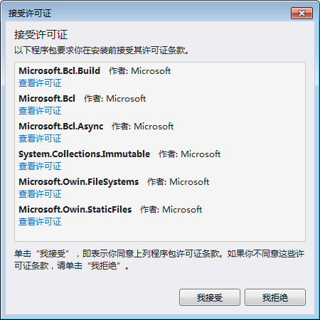
观察输出窗口，发现VS已经开始下载要更新的Nuget包并安装，如图1.5。


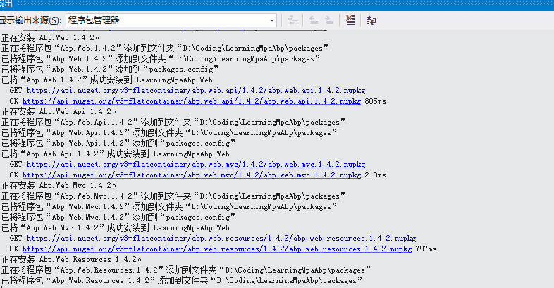
因为Abp V1.4.2已经支持TypeScript，VS解析到需要安装TypeScript，弹出图1.6所示对话框。


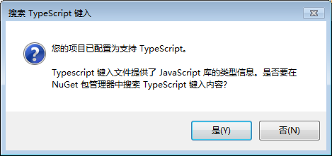
点【是】进入下一步。稍等2分钟，即可成功安装，如图1.7。


1.3. 编译项目

编译项目，报了一堆错误，如图1.8。


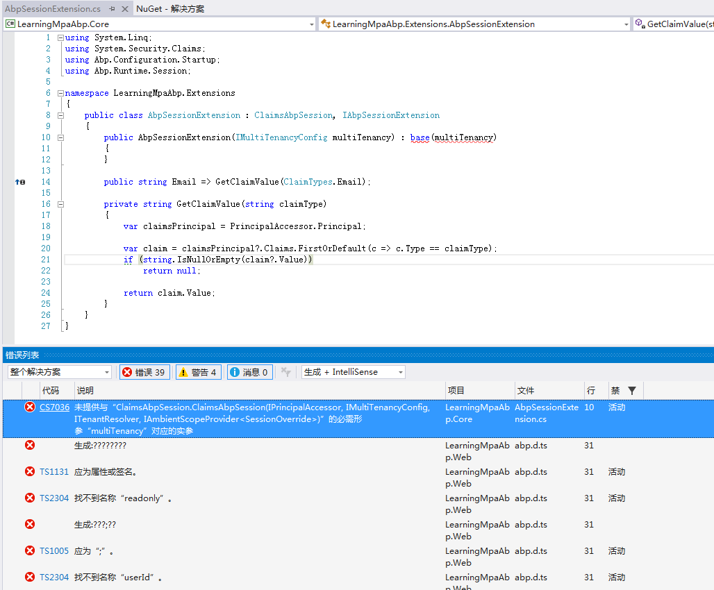
第一个错误好解决，是我们扩展AbpSesion出的错误。定位一看，原来是Abp修改了默认IAbpSession的实现类ClaimsAbpSession。我们只需要删除报错的构造方法，按下面方式更改即可：

public AbpSessionExtension(IPrincipalAccessor principalAccessor, IMultiTenancyConfig multiTenancy,
            ITenantResolver tenantResolver, IAmbientScopeProvider<SessionOverride> sessionOverrideScopeProvider)
            : base(principalAccessor, multiTenancy, tenantResolver, sessionOverrideScopeProvider)
        {
        }
接下来的错误都是Typescript报的错，需要安装下TypeScript。

1.4. 安装TypeScript

依次点击【工具-->扩展和更新-->联机】，在右边搜索框中搜索typescript，并按【最新】排序，搜索结果如图1.9。选择最新版本下载后，关闭VS，安装即可。


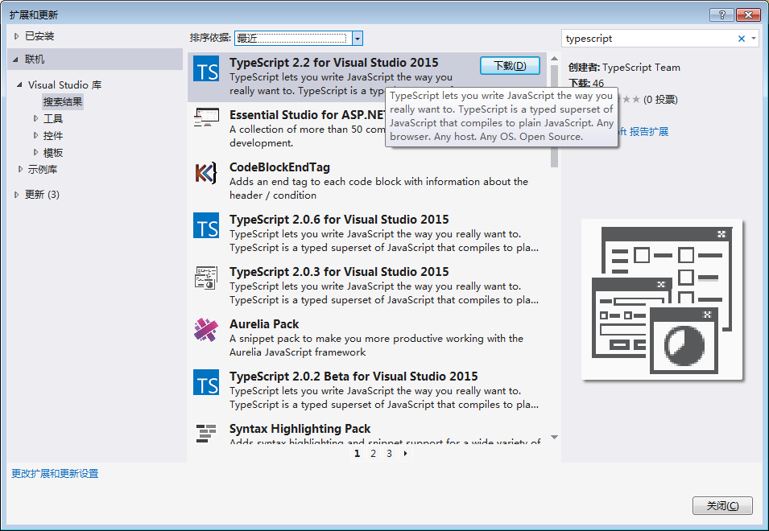
1.5. 运行Web项目

重新编译下，Ctrl+F5运行web项目，报错如图2.0。


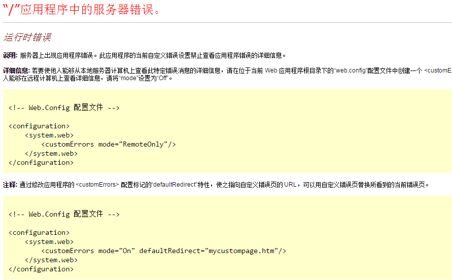

按照图示所言，修改web.config中的customErrors节点为Off，<customErrors mode="Off" />。重新运行Web项目，报错如图2.1。


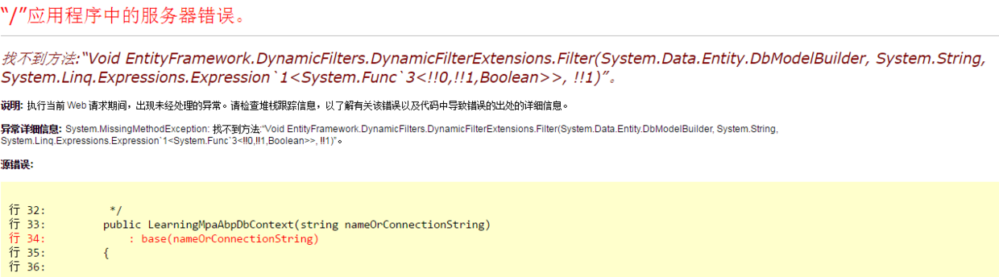
一看是 EntityFramework.DynamicFilters相关错误，这个是一个第三方Nuget包，用来支持EF进行Linq动态过滤的。猜到一种可能是升级后的DynamicFilters删除了图中的扩展方法，导致出错。到abp官方github上的项目上根据关键字搜索Issue，如图2.2。


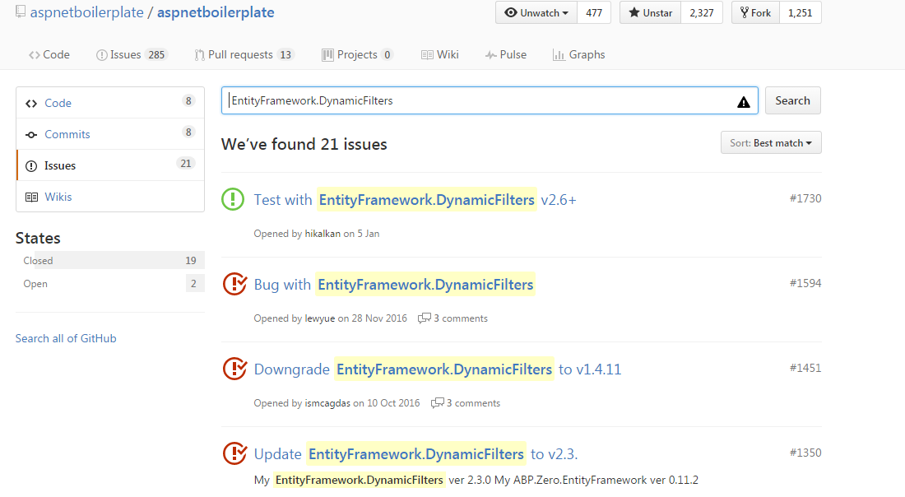
果然大家跟我们报的一样的错，其中已经给出了解决方案，需要将DynamicFilterNuget包降级到1.4.11。

右键解决方案，选择【管理解决方案的Nuget程序包（Ｎ）...】，在搜索框中输入 【EntityFramework.DynamicFilters】过滤，并选中依赖的项目，在版本下拉框中选择1.4.11，点击安装，如图2.3。


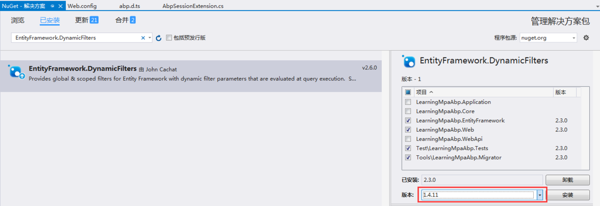
重新编译，再次启动web项目，还是报错，如图2.4。


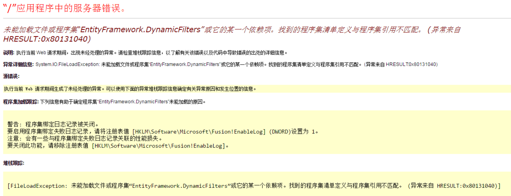
是不是快崩溃了，别怕，跟着我做，让你气死回生。
分别定位到依赖EntityFramework.DynamicFilters组件的项目，修改App.Config或Web.Config，找到以下节点：
```
<dependentAssembly>
  <assemblyIdentity name="EntityFramework.DynamicFilters" publicKeyToken="146423a1b8d60775" culture="neutral" />
  <bindingRedirect oldVersion="0.0.0.0-2.3.0.0" newVersion="2.3.0.0" />
</dependentAssembly>
```
是不是吐血，降级后，VS没有更改依赖组件的版本。修改如下：
```
<dependentAssembly>
  <assemblyIdentity name="EntityFramework.DynamicFilters" publicKeyToken="146423a1b8d60775" culture="neutral" />
  <bindingRedirect oldVersion="0.0.0.0-1.4.11" newVersion="1.4.11" />
</dependentAssembly>
```
修改完毕后，重新编译，启动web项目，这一次终于显示久违的登陆界面，预示着这次升级折腾结束了。

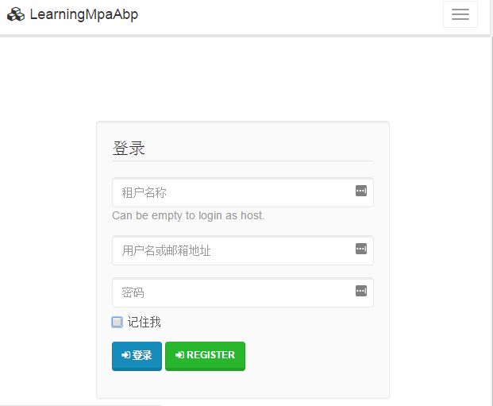
有了这次升级折腾经验，下次我想咱就不怕了。

2. 调试源码

按照作者的官方如何调试的文档介绍[Debuging](https://www.aspnetboilerplate.com/Pages/Documents/Debugging)，所有官方ASP.NET Boilerplate nuget包都启用了GitLink。这意味着您可以轻松地在项目中调试Abp.* nuget包。
但是由于GitLink暂不支持 xproj/project.json格式，所以我们暂时用不了GitLink进行调试。

这里另外提供一种调试的方式：

2.1. 下载与本地模板项目版本一致的Abp源码

首先去看看Abp的[Releases](https://github.com/aspnetboilerplate/aspnetboilerplate/releases)目录，找到对应版本的Source code.zip，下载即可。

2.2. 还原Nuget包

打开下载下来的源码解决方案，右键解决方案，选择还原Nuget包。还原成功后，重新编译项目。

2.3. 附加进程调试

Ctrl+F5运行web项目，然后在源码对应解决方案，选择【调试-->附加到进程】，从进程列表中，选择【iisexpress.exe】进程附加即可。打个断点，就可以调试了。
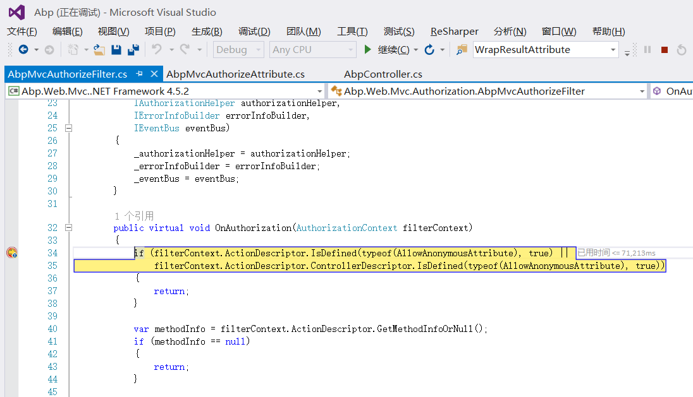
