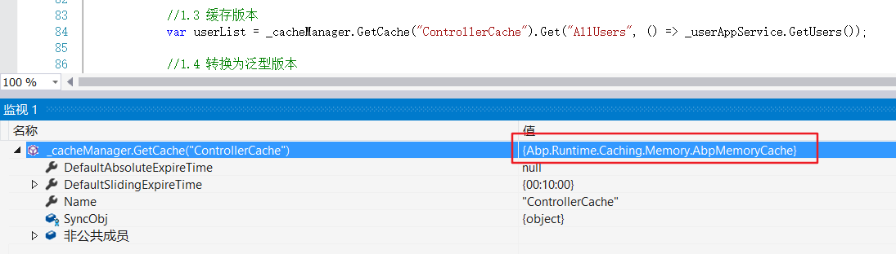
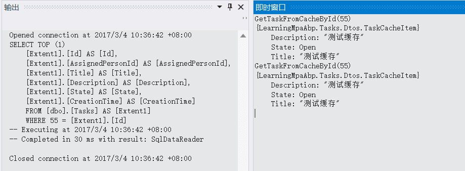
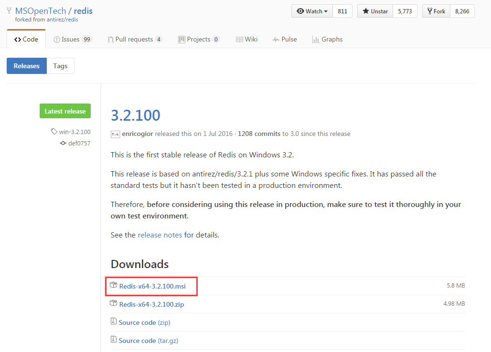
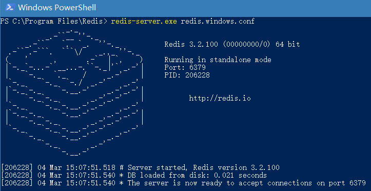
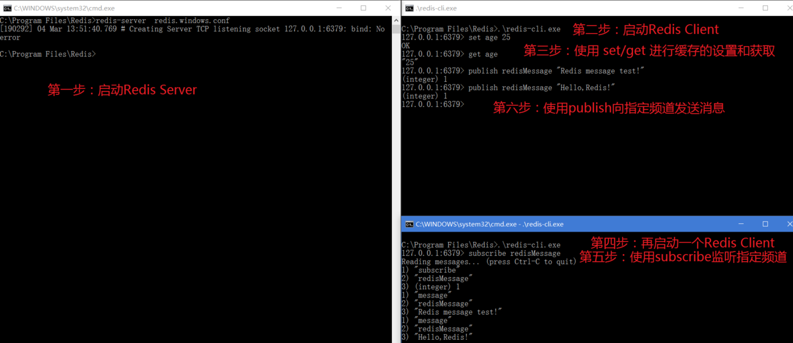
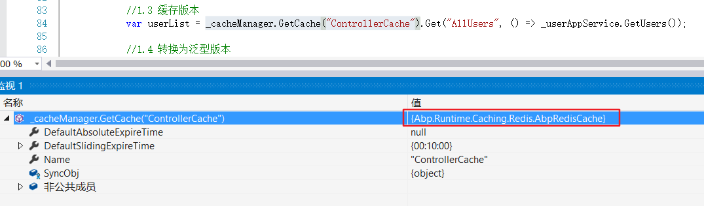

## 一、引言

创建任务时我们需要指定分配给谁，Demo中我们使用一个下拉列表用来显示当前系统的所有用户，以供用户选择。我们每创建一个任务时都要去数据库取一次用户列表，然后绑定到用户下拉列表显示。如果就单单对一个demo来说，这样实现也无可厚非，但是在正式项目中，显然是不合理的，浪费程序性能，有待优化。
说到优化，你肯定立马就想到了使用缓存。是的，缓存是提高程序性能的高效方式之一。
这一节我们就针对这一案例来看一看Abp中如何使用缓存来提高程序性能。

## 二、Abp的缓存机制

在直接使用缓存之前，我们还是来简单梳理下Abp的缓存机制。
Abp之所以能成为一个优秀的DDD框架，我想跟作者详细的文档有很大关系，
作者已经在ABP官方文档介绍了如何使用Caching，英文水平好的就直接看官方的吧。

Abp对缓存进行抽象定义了ICache接口，位于Abp.Runtime.Caching命名空间。
并对ICache提供了默认的实现AbpMemoryCache，AbpMemoryCache是基于MemoryCache的一种实现方式。MemoryCache是微软的一套缓存机制，定义在System.Runtime.Caching命名空间，顾名思义 ，在内存中进行高速缓存。我们通过类型依赖图来看下Abp对Cache的实现：


从图中可以看出主要包括四个部分：

* ICache->CacheBase->AbpMemoryCache：对缓存的抽象以及实现；
* ITypedCache：缓存的泛型实现；
* ICacheManager->CacheManagerBase->AbpMemoryCacheManager：缓存管理类的抽象和实现，代码中可以通过注入ICacheManager来获取缓存；
* ICachingConfiguration->CachingConfiguration：用来配置使用哪种缓存。
## 三、Abp缓存实操演练

### 1、定位优化点

定位到我们的TasksController，其中有两种创建Task的Action，代码如下：
```
public PartialViewResult RemoteCreate() {
    var userList = _userAppService.GetUsers();
    ViewBag.AssignedPersonId = new SelectList(userList.Items, "Id", "Name");
    return PartialView("_CreateTaskPartial");
}

[ChildActionOnly] 
public PartialViewResult Create() {
    var userList = _userAppService.GetUsers();
    ViewBag.AssignedPersonId = new SelectList(userList.Items, "Id", "Name");
    return PartialView("_CreateTask");
}
```
可以看到两个方法都需要调用_userAppService.GetUsers();来获取用户列表。
现在我们来使用缓存技术对其优化。首先我们应该想到了Asp.net mvc自带的一套缓存机制，OutputCache。

### 2、使用[OutputCache]进行缓存

如果对OutputCache不了解，可以参考我的这篇文章[Asp.net mvc 知多少（九）](http://www.jianshu.com/p/2ebfcc4bf897)。

我们可以简单在Action上添加[OutputCache]特性即可。
```
[OutputCache(Duration = 1200, VaryByParam = "none")]
[ChildActionOnly] 
public PartialViewResult Create() {
    var userList = _userAppService.GetUsers();
    ViewBag.AssignedPersonId = new SelectList(userList.Items, "Id", "Name");
    return PartialView("_CreateTask");
}
```
[OutputCache(Duration = 1200, VaryByParam = "none")]这句代码的意思是该action只缓存1200s。1200s后，ASP.NET MVC会重新执行action并再次缓存。因为是在[ChildActionOnly]中使用[OutputCache]，所以该缓存属于Donut Hole caching。
在该方法内部打个断点，测试只有第一次调用会进入方法内部，之后1200s内都不会再进入该方法，1200s后会再次进入，说明缓存成功！

### 3、使用ICacheManager进行缓存

按照上面对Abp缓存机制的梳理，我们可以在需要使用缓存的地方注入ICacheManager来进行缓存管理。
现在我们就在TasksController中注入ICacheManager。
申明私有变量，并在构造函数中注入，代码如下：
```
private readonly ITaskAppService _taskAppService;
private readonly IUserAppService _userAppService;
private readonly ICacheManager _cacheManager;

public TasksController(ITaskAppService taskAppService, IUserAppService userAppService, ICacheManager _cacheManager) {
    _taskAppService = taskAppService;
    _userAppService = userAppService;
    _cacheManager = cacheManager;
}
```
下面修改RemoteCreateaction如下：
```
public PartialViewResult RemoteCreate()
{   
    var userList = _cacheManager.GetCache("ControllerCache").Get("AllUsers", 
                          () => _userAppService.GetUsers()) as ListResultDto<UserListDto>;
    ViewBag.AssignedPersonId = new SelectList(userList.Items, "Id", "Name");
    return PartialView("_CreateTaskPartial");
}
```
分析代码发现我们在通过上面代码中获取的缓存是需要进行类型转换的。原来_cacheManager.GetCache返回的是ICache类型，而ICache定义key-value对应的是string-object类型，所以自然从缓存获取完数据后要进行类型转换了（注：最新Abp版本为ICache提供了扩展方法，不再需要显示进行类型转换）。那有没有泛型版本？聪明如你，作者对ICache进行包装封装了个ITypedCache以实现类型安全。代码种进行了5种实现，可以一探究竟：
```
public PartialViewResult RemoteCreate()
{
    //1.1 注释该段代码，使用下面缓存的方式
    //var userList = _userAppService.GetUsers();

    //1.2 同步调用异步解决方案（最新Abp创建的模板项目已经去掉该同步方法，所以可以通过下面这种方式获取用户列表）
    //var userList = AsyncHelper.RunSync(() => _userAppService.GetUsersAsync());

    //1.3 缓存版本
    var userList = _cacheManager.GetCache("ControllerCache").Get("AllUsers", () => _userAppService.GetUsers());

    //1.4 转换为泛型版本
    //var userList = _cacheManager.GetCache("ControllerCache").AsTyped<string, ListResultDto<UserListDto>>().Get("AllUsers", () => _userAppService.GetUsers());

    //1.5 泛型缓存版本
    //var userList = _cacheManager.GetCache<string, ListResultDto<UserListDto>>("ControllerCache").Get("AllUsers", () => _userAppService.GetUsers());

    ViewBag.AssignedPersonId = new SelectList(userList.Items, "Id", "Name");
    return PartialView("_CreateTaskPartial");
}
```
经测试，用户列表正确缓存。


与[OutputCache]相比，我们很自然就会问Abp提供的缓存怎么没有配置缓存过期时间，你想到的框架肯定也想到了，Abp的默认缓存过期时间是60mins，我们可以通过在使用缓存项目的Module（模块）中自定义缓存时间。
因为我们是在Web项目中使用的Cache，所以定位到XxxWebModule.cs，在PreInitialize方法中进行缓存配置。
```
//配置所有Cache的默认过期时间为2小时
Configuration.Caching.ConfigureAll(cache =>
{
    cache.DefaultSlidingExpireTime = TimeSpan.FromHours(2);
});

//配置指定的Cache过期时间为10分钟
Configuration.Caching.Configure("ControllerCache", cache =>
{
    cache.DefaultSlidingExpireTime = TimeSpan.FromMinutes(10);
});
```
### 4、使用IEntityCache对实体进行缓存

#### 1、缓存方式的思考

上面的两种缓存方式，我们一般用于存储自定义缓存，但有一个局限性，受到具体缓存过期时间的限制。
思考一下，我们缓存的用户列表，它是一个实时会变化的集合，而这个实时是不定时的，可能1mins之内就有新用户注册，也有可能几天没有用户注册（比如我们这个Demo），这个时候就不好设置缓存过期（刷新）时间。
但由于我们是Demo性质只是为了演示用法，所以我们设定缓存过期时间为10mins也无可厚非。

那有没有一种缓存机制，不需要设置缓存过期时间，当数据变化的时候就能自动重新缓存呢？
答案是肯定的，Abp为我们提供了IEntityCache，实体缓存机制。
当我们需要通过ID获取实体数据而又不想经常去数据库查询时，我们就可以使用IEntityCache。
**换句话说，IEntityCache支持按实体Id进行动态缓存。**

#### 2、IEntityCache缓存原理

在演示具体操作之前，我们先来讲解下IEntityCache的缓存原理：

* 首先它第一次从数据库中获取实体，然后后续调用将会从缓存获取。
* 当实体更新或删除时它自动将缓存的实体置为无效状态，因此它将会再下一次请求中从数据库中重新获取。
* 它使用缓存的类的完整类名作为缓存名称，可以通过为构造函数传参来修改缓存名称。
它是线程安全的。
* 它使用IObjectMapper将实体映射到缓存项。 IObjectMapper由AutoMapper模块实现。所以，如果你使用它，你需要AutoMapper模块。您可以覆盖MapToCacheItem方法以手动将实体映射到缓存项。
#### 3、IEntityCache上手实战

既然是缓存实体，基于我们这个demo，我们就拿Task实体玩一下吧。
在这里我们先要复习下什么是DTO，重申下DDD为什么引入DTO。
Data Transfer Objects（DTO）用来在应用层和展现层之间传输数据。

DTO的必要性：

1. 领域层的抽象
2. 数据隐藏
3. 序列化和延迟加载问题

那这个DTO跟要讲的实体缓存有什么关系呢？
不绕弯子了，就是说实体缓存不应直接对Entity进行缓存，以避免缓存时序列化了不该序列化的对象和实体。
那具体怎么操作呢？我们就直接上Demo吧。
我们定义一个TaskCacheItem，用来缓存Title、Description、State。并定义映射规则[AutoMapFrom(typeof(Task))]。
```
namespace LearningMpaAbp.Tasks.Dtos
{
    [AutoMapFrom(typeof(Task))]
    public class TaskCacheItem
    {
        public string Title { get; set; }

        public string Description { get; set; }

        public TaskState State { get; set; }
    }
}
```
下面我们定义一个针对TaskCacheItem的缓存接口。
```
namespace LearningMpaAbp.Tasks
{
    public interface ITaskCache:IEntityCache<TaskCacheItem>
    {
    }
}
```
实现ITaskCache缓存接口：
```
namespace LearningMpaAbp.Tasks
{
    public class TaskCache : EntityCache<Task, TaskCacheItem>, ITaskCache, ISingletonDependency
    {
        public TaskCache(ICacheManager cacheManager, IRepository<Task, int> repository, string cacheName = null) 
            : base(cacheManager, repository, cacheName)
        {
        }
    }
}
```
现在，当我们需要根据TaskId获取Title、Description、State，我们就可以通过在需要的类中注入注入ITaskCache，来从缓存中获取。
下面我们在ITaskAppService中添加一个接口TaskCacheItem GetTaskFromCacheById(int taskId);。
然后在TaskAppService中实现它，申明变量并在构造函数注入ITaskCache，实现定义的接口：
```
private readonly ITaskCache _taskCache;

/// <summary>
///     In constructor, we can get needed classes/interfaces.
///     They are sent here by dependency injection system automatically.
/// </summary>
public TaskAppService(IRepository<Task> taskRepository, IRepository<User, long> userRepository,
    ISmtpEmailSenderConfiguration smtpEmialSenderConfigtion, INotificationPublisher notificationPublisher, ITaskCache taskCache)
{
    _taskRepository = taskRepository;
    _userRepository = userRepository;
    _smtpEmialSenderConfig = smtpEmialSenderConfigtion;
    _notificationPublisher = notificationPublisher;
    _taskCache = taskCache;
}

public TaskCacheItem GetTaskFromCacheById(int taskId)
{
    return _taskCache[taskId];
}
```
测试如下，直接在即时窗口调用方法，发现只有一条Sql查询生成，说明实体缓存成功。



可能读到这里，你可能会问，说好的『Redis缓存用起来』，你讲了半天，跟Redis没有半毛钱关系啊。

Redis这么厉害的技能，当然要压轴出场啊，下面Redis开讲。

## 四、Redis是什么玩意

>Redis 是一个开源（BSD许可）的，内存中的数据结构存储系统，它可以用作数据库、缓存和消息中间件。它支持多种类型的数据结构，如字符串（strings）、散列（hashes）、列表（lists）、集合（sets）、有序集合（sorted sets）与范围查询、bitmaps、hyperloglogs和地理空间（geospatial）索引半径查询。
官方的解释就是这么拗口，对于初识Redis，我们可以简单把它理解为基于内存的速度非常快性能非常棒的Key-Value数据库。

有一点需要说明，Redis官方仅支持Linux系统不支持Windows系统。
但是呢，微软大法好啊，微软开源技术团队（Microsoft Open Tech group）开发和维护了一个Win64 的版本，我们可以在[https://github.com/MSOpenTech/redis](https://github.com/MSOpenTech/redis)上下载Win64版本来玩一玩。

想了解更多，请参考[中文官方文档](http://www.redis.cn/)或[英文官方文档](http://www.redis.cn/)。

## 五、动手试玩Redis

### 1、安装Redis

打开微软开源技术团队维护的Redis Github[链接](https://github.com/MSOpenTech/redis)，找到Releases目录，下载最新版本的msi安装即可。


下载后，一直下一步安装即可。

### 2、简单试玩

找到安装目录，打开cmd并进入到安装目录，输入redis-server  redis.windows.conf，即可启动Redis 服务。Redis服务默认启动在6379端口。



再启动一个cmd窗口，执行redis-cli.exe即可开一个Redis客户端。
执行set命令进行缓存设置；
执行get命令进行缓存读取；
执行subscribe命令进行频道监听；
执行publish命令向指定频道发布消息；
具体步骤详参下图：



## 六、ABP上试玩Redis缓存

跟着我的步伐，对Redis也算有了基本的认识，咱们下面就进入今天的压轴主题，介绍Abp下如何使用redis进行缓存。
首先我们要知道为什么要用Redis进行缓存。
默认的缓存管理是在内存中（in-memory）进行缓存。当你有不止一个并发web服务器需要运行同一个应用程序，默认的缓存管理就不满足你的需求。你可能需要一个分布式/中央缓存服务器来进行缓存管理，这时Redis就可以粉墨登场了。

### 1、Abp集成Redis

首先打开Web层，下载Abp.RedisCache Nuget包安装。
其中要说明的是Abp.RedisCache是依赖StackExchange.RedisNuget包的。

修改XxxWebModule.cs，在DependsOn特性上添加对AbpRedisCacheModule的依赖，并在模块的PreInitialize方法中调用UseRedis扩展方法，代码如下：
```
[DependsOn(
        typeof(LearningMpaAbpDataModule),
        typeof(LearningMpaAbpApplicationModule),
        typeof(LearningMpaAbpWebApiModule),
        typeof(AbpWebSignalRModule),
        //typeof(AbpHangfireModule), - ENABLE TO USE HANGFIRE INSTEAD OF DEFAULT JOB MANAGER
        typeof(AbpWebMvcModule),
        typeof(AbpRedisCacheModule))]
    public class LearningMpaAbpWebModule : AbpModule
    {
        public override void PreInitialize()
        {
            //省略其他配置代码

            //配置使用Redis缓存
            Configuration.Caching.UseRedis();

            //配置所有Cache的默认过期时间为2小时
            Configuration.Caching.ConfigureAll(cache =>
            {
                cache.DefaultSlidingExpireTime = TimeSpan.FromHours(2);
            });

            //配置指定的Cache过期时间为10分钟
            Configuration.Caching.Configure("ControllerCache", cache =>
            {
                cache.DefaultSlidingExpireTime = TimeSpan.FromMinutes(10);
            });            
        }
  ....
}
```
最后一步在Web.Config文件的【connectionStrings】节点为Abp.Redis.Cache添加连接字符串，如下：
```
  <connectionStrings>
    <add name="Default" connectionString="Server=.\sqlexpress; Database=LearningMpaAbp; Trusted_Connection=True;" providerName="System.Data.SqlClient" />
    <add name="Abp.Redis.Cache" connectionString="localhost"/>
  </connectionStrings>
```
启动Redis Server后，F5运行web项目，断点调试，发现已经成功应用Redis缓存。
若未启动Redis Server，会报Error：It was not possible to connect to the redis server(s); to create a disconnected multiplexer, disable AbortOnConnectFail. SocketFailure on PING


这样我们就用Redis代替了默认的MemoryCache缓存方案，而不需要改动其它代码,Abp就是这么简单、灵活、松藕合！

7. 总结

这篇文章中主要梳理了Abp中如何进行缓存管理，并简要介绍了Abp中的缓存机制，并与Asp.net mvc自带的[Outputcache]缓存进行简要对比，并进行了缓存管理实战演练。最后对Redis进行了简要介绍，并介绍了如何切换Redis缓存。